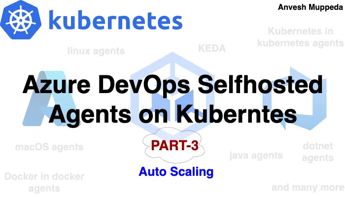
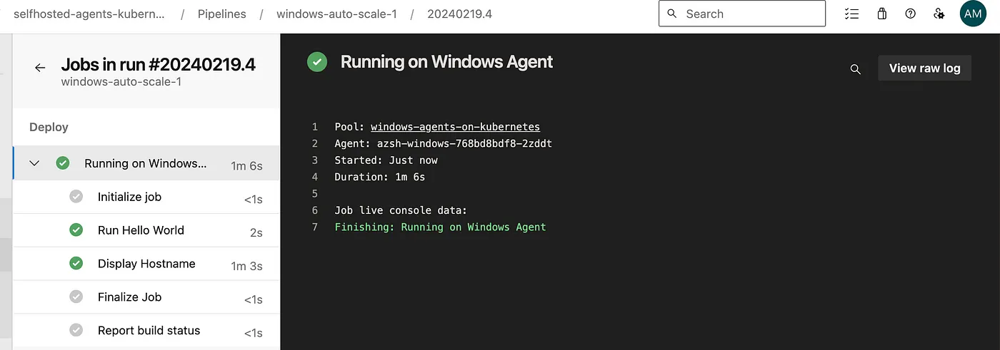
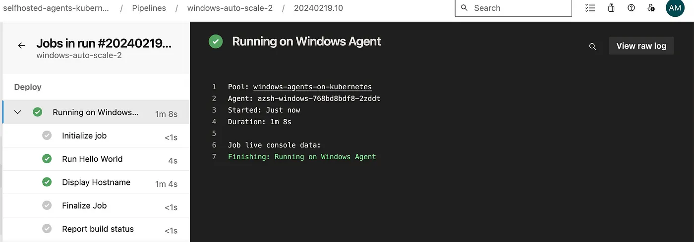

# ⎈ Azure DevOps — Self Hosted Agents on Kubernetes — PART-3 ⎈  

#### *Scaling Self-Hosted Agents on Kubernetes with KEDA 📈*



### Welcome to Part 3
Welcome back to our ongoing journey through the fusion of Azure DevOps and Kubernetes! In this third installment, we’re diving deep into a fascinating realm of Kubernetes management: the auto-scaling of self-hosted agents using Kubernetes Event-driven Autoscaling (KEDA).  

Get ready to bid farewell to those lengthy queues and usher in a new era of efficiency in our CI/CD pipelines! In this latest chapter of our Azure DevOps and Kubernetes saga, we’re embracing KEDA to say goodbye to wait times and revolutionize how we allocate resources. With KEDA at our disposal, we’re poised to transform the scalability of our self-hosted agents, banishing bottlenecks and ensuring swift deployments every time. Join us on this journey towards operational excellence as we harness the power of KEDA and wave goodbye to long queues once and for all!
### Install KEDA(Kubernetes Event-driven Autoscaling)

To deploy KEDA (Kubernetes Event-driven Autoscaling) using Helm, you can follow these steps:

1. **Add Helm Repo:** Add the KEDA Helm repository to your Helm configuration. Run the following command:

```yaml
helm repo add kedacore https://kedacore.github.io/charts
```

2. **Update Helm Repo:** After adding the repository, make sure to update your local Helm repository cache with the latest information from the added repositories. Run:

```yaml
helm repo update
```

3. **Install KEDA Helm Chart:** Use Helm to install the KEDA Helm chart. Since you want to install it in the keda namespace and create the namespace if it doesn't exist, use the following command:

```yaml
helm install keda kedacore/keda --namespace keda --create-namespace
```
This command installs the KEDA Helm chart named keda from the kedacore repository into the keda namespace, creating the namespace if it doesn't already exist.

4. Verify the all KEDA resources are up and running using below command

```yaml
kubectl get all -n keda
```
```yaml
kubectl get all -n keda                  
NAME                                                   READY   STATUS    RESTARTS      AGE
pod/keda-admission-webhooks-689544998-g9lpt            1/1     Running   0             75m
pod/keda-operator-898ccf84f-j6ghd                      1/1     Running   1 (77m ago)   77m
pod/keda-operator-metrics-apiserver-688659cccb-g6n2g   1/1     Running   0             73m

NAME                                      TYPE        CLUSTER-IP     EXTERNAL-IP   PORT(S)            AGE
service/keda-admission-webhooks           ClusterIP   10.0.189.174   <none>        443/TCP            98m
service/keda-operator                     ClusterIP   10.0.198.219   <none>        9666/TCP           98m
service/keda-operator-metrics-apiserver   ClusterIP   10.0.188.67    <none>        443/TCP,8080/TCP   98m

NAME                                              READY   UP-TO-DATE   AVAILABLE   AGE
deployment.apps/keda-admission-webhooks           1/1     1            1           98m
deployment.apps/keda-operator                     1/1     1            1           98m
deployment.apps/keda-operator-metrics-apiserver   1/1     1            1           98m

NAME                                                         DESIRED   CURRENT   READY   AGE
replicaset.apps/keda-admission-webhooks-54764ff7d5           0         0         0       98m
replicaset.apps/keda-admission-webhooks-689544998            1         1         1       75m
replicaset.apps/keda-operator-567cb596fd                     0         0         0       98m
replicaset.apps/keda-operator-898ccf84f                      1         1         1       77m
replicaset.apps/keda-operator-metrics-apiserver-6475bf5fff   0         0         0       98m
replicaset.apps/keda-operator-metrics-apiserver-688659cccb   1         1         1       73m
```
With these steps, you’ll have deployed KEDA into your Kubernetes cluster using Helm. Make sure to adjust the namespace or any other parameters as needed for your specific environment.


### Deploy KEDA ScaledObject

After successfully installing KEDA into your Kubernetes cluster, it’s essential to verify that all KEDA resources are up and running to ensure proper functionality. This step ensures that KEDA is ready to scale your deployments based on specified triggers.
 
Once you’ve confirmed that KEDA resources are operational, the next step is to deploy the KEDA ScaledObject. This deployment enables KEDA to initiate scaling actions based on predefined triggers. In this case, we’ll configure the ScaledObject to scale based on the queue length of an Azure Pipelines agent pool.

Let’s Deploy the KEDA ScaledObject Using the below steps:  

Create a Secret:  

Use the following YAML to create a Secret named pipeline-auth with your personal access token (PAT) encoded in base64:

```yaml
apiVersion: v1
kind: Secret
metadata:
  name: pipeline-auth
data:
  personalAccessToken: '<your base64 PAT>'
```
Replace <your base64 PAT> with your actual personal access token encoded in base64.

Run the below command(assuming you save the YAML in a file named secret.yaml) to create the Secret in your Kubernetes cluster or you can use the previous secret which we created part of the windows/linux agent deployment.  

```yaml
kubectl apply -f secret.yaml
```
Create a TriggerAuthentication:

Use the following YAML to create a TriggerAuthentication named pipeline-trigger-auth:
```yaml
apiVersion: keda.sh/v1alpha1
kind: TriggerAuthentication
metadata:
  name: pipeline-trigger-auth
spec:
  secretTargetRef:
    - parameter: personalAccessToken
      name: pipeline-auth
      key: personalAccessToken
```
Run below command to create the TriggerAuthentication in your Kubernetes cluster.
```yaml
kubectl apply -f trigger-auth.yaml
```


Create a ScaledObject:

Use the following YAML to create a ScaledObject named azure-pipelines-scaledobject.yaml:

```yaml
apiVersion: keda.sh/v1alpha1
kind: ScaledObject
metadata:
  name: azure-pipelines-scaledobject
  namespace: az-devops
spec:
  scaleTargetRef:
    name: azsh-windows #Target agent deployment name
  minReplicaCount: 1
  maxReplicaCount: 5 #Maximum number of parallel instances
  triggers:
  - type: azure-pipelines
    metadata:
      poolID: "<Agent Pool Id>" #Replace with your agent pool ID
      organizationURLFromEnv: "AZP_URL"
    authenticationRef:
     name: pipeline-trigger-auth
```
Replace <Agent Pool Id> with your actual value. By specifying the <Agent Pool ID> parameter in the ScaledObject configuration, KEDA will automatically scale the deployment according to the queue size of the specified agent pool. Additionally, the ScaledObject will ensure that scaling operations stay within the defined minimum and maximum replica counts, providing flexibility and control over resource allocation.  

To get the Agent Pool ID from the Azure DevOps console, follow these steps:  


1. **Navigate to Azure DevOps:** Go to the Azure DevOps portal at dev.azure.com.

2. **Select Organization:** Choose the organization where your agent pool is located.

3. **Go to Agent Pools:** In the left sidebar, click on “Organization settings” (you may need to click on the gear icon to access this), then select “Agent pools” under the “Pipelines” section.

4. **View Agent Pool:** You will see a list of agent pools available in your project. Click on the agent pool that you want to get the ID for.

5. **Get Agent Pool ID:** Once you’re in the agent pool details view, you should see the ID displayed in the URL of your browser. The URL will look something like this:

```yaml
https://dev.azure.com/{organization}/{project}/_settings/agentpools?poolId={poolId}
```
Now run the below command to create the ScaledObject in your Kubernetes cluster.

```yaml
kubectl apply -f scaled-object.yaml
```
By running above command our scaled object is created succesfully. To ensure that the KEDA ScaledObject is properly configured and aligned with your target deployment, you can use the following commands to check its status and the status of all resources in the az-devops namespace:
```yaml
kubectl get scaledobject -n az-devops
kubectl get all -n az-devops
```
The first command (kubectl get scaledobject -n az-devops) will display information about the KEDA ScaledObject, including its name, the associated deployment, the minimum and maximum replica counts, and any configured triggers. This will help you verify that the ScaledObject is configured correctly according to your requirements.

```yaml
kubectl get scaledobject -n az-devops
NAME                           SCALETARGETKIND      SCALETARGETNAME   MIN   MAX   TRIGGERS          AUTHENTICATION          READY   ACTIVE   FALLBACK   PAUSED    AGE
azure-pipelines-scaledobject   apps/v1.Deployment   azsh-windows      1     5     azure-pipelines   pipeline-trigger-auth   True    False    False      Unknown   95m

```
The second command (kubectl get all -n az-devops) will provide information about all resources in the az-devops namespace, including deployments, pods, services, and any other resources that may be present. This will allow you to verify the overall status of your deployment and ensure that all associated resources are running as expected.
```yaml
kubectl get all -n az-devops
NAME                                READY   STATUS    RESTARTS   AGE
pod/azsh-windows-768bd8bdf8-2zddt   1/1     Running   0          101m

NAME                           READY   UP-TO-DATE   AVAILABLE   AGE
deployment.apps/azsh-windows   1/1     1            1           101m

NAME                                      DESIRED   CURRENT   READY   AGE
replicaset.apps/azsh-windows-768bd8bdf8   1         1         1       101m

NAME                                                                        REFERENCE                 TARGETS     MINPODS   MAXPODS   REPLICAS   AGE
horizontalpodautoscaler.autoscaling/keda-hpa-azure-pipelines-scaledobject   Deployment/azsh-windows   0/1 (avg)   1         5         1          86m

```
By running these commands, you can confirm that the KEDA ScaledObject is configured properly and that your deployment is ready to scale based on the specified triggers. If everything looks correct, you can proceed confidently knowing that your Kubernetes environment is set up for efficient and automated scaling. 

In summary, deploying the KEDA ScaledObject with the azure-pipelines trigger enables dynamic scaling of deployments in response to changes in the Azure Pipelines agent pool queue length. This automation enhances efficiency and responsiveness in managing workload demands within the Kubernetes environment.
### Auto Scaling Testing using KEDA
Create two pipelines to test the auto scaling make sure both the pipelines are aligned with the single agent pool which we mentioned in the above ScaledObject.

***Follow Part 1 & Part 2 to create the pipelines***


Make sure the agent is ready within the agent pool to run the pipelines.


Indeed, with traditional setup, if you have a single agent capable of running only one pipeline at a time, the second pipeline will be queued until the first one completes its execution. However, with KEDA auto-scaling configured based on the Azure Pipelines agent pool queue size, the behavior might change.   

Once KEDA is set up and configured properly, it will monitor the queue size of the Azure Pipelines agent pool. As soon as a pipeline is queued, KEDA will detect the increased load and trigger scaling actions automatically. It will dynamically adjust the number of replicas of your deployment to accommodate the increased workload.   

In this scenario, when the first pipeline is queued and starts running, KEDA will detect the increased demand for resources and scale up the deployment accordingly to handle the workload. As a result, the second pipeline won’t be left waiting in the queue for an available agent. Instead, KEDA will ensure that there are sufficient resources (replicas) available to run both pipelines simultaneously, or at least minimize the wait time for the second pipeline.

Now, once you trigger the both pipelines 
horizontalpodautoscaler.autoscaling startnig creating the new agent.

```yaml
kubectl get all -n az-devops         
NAME                                READY   STATUS              RESTARTS   AGE
pod/azsh-windows-768bd8bdf8-2zddt   1/1     Running             0          112m
pod/azsh-windows-768bd8bdf8-jfcj9   0/1     ContainerCreating   0          5s

NAME                           READY   UP-TO-DATE   AVAILABLE   AGE
deployment.apps/azsh-windows   1/2     2            1           112m

NAME                                      DESIRED   CURRENT   READY   AGE
replicaset.apps/azsh-windows-768bd8bdf8   2         2         1       112m

NAME                                                                        REFERENCE                 TARGETS     MINPODS   MAXPODS   REPLICAS   AGE
horizontalpodautoscaler.autoscaling/keda-hpa-azure-pipelines-scaledobject   Deployment/azsh-windows   2/1 (avg)   1         5         1          97m
```
Already, first pipeline is running on first pod and once the second pod is started running then automatically second pipeline will assign to the second pod.
```yaml
kubectl get all -n az-devops
NAME                                READY   STATUS    RESTARTS   AGE
pod/azsh-windows-768bd8bdf8-2zddt   1/1     Running   0          113m
pod/azsh-windows-768bd8bdf8-jfcj9   1/1     Running   0          31s

NAME                           READY   UP-TO-DATE   AVAILABLE   AGE
deployment.apps/azsh-windows   2/2     2            2           113m

NAME                                      DESIRED   CURRENT   READY   AGE
replicaset.apps/azsh-windows-768bd8bdf8   2         2         2       113m

NAME                                                                        REFERENCE                 TARGETS     MINPODS   MAXPODS   REPLICAS   AGE
horizontalpodautoscaler.autoscaling/keda-hpa-azure-pipelines-scaledobject   Deployment/azsh-windows   1/1 (avg)   1         5         2          97m
```
Now both the agent are online and ready to execute the pipelines.


So finally without any wait time and without any queue, we successfully completed both the pipelines.





Once both the pipelines are executed successfully, the extra agent will be deleted automatically.

```yaml
kubectl get all -n az-devops
NAME                                READY   STATUS    RESTARTS   AGE
pod/azsh-windows-768bd8bdf8-2zddt   1/1     Running   0          101m

NAME                           READY   UP-TO-DATE   AVAILABLE   AGE
deployment.apps/azsh-windows   1/1     1            1           101m

NAME                                      DESIRED   CURRENT   READY   AGE
replicaset.apps/azsh-windows-768bd8bdf8   1         1         1       101m

NAME                                                                        REFERENCE                 TARGETS     MINPODS   MAXPODS   REPLICAS   AGE
horizontalpodautoscaler.autoscaling/keda-hpa-azure-pipelines-scaledobject   Deployment/azsh-windows   0/1 (avg)   1         5         1          86m
```

By leveraging KEDA auto-scaling, you can improve the efficiency of your CI/CD pipeline execution by dynamically adjusting resource allocation based on workload demands, ultimately reducing queue times and improving overall throughput.


