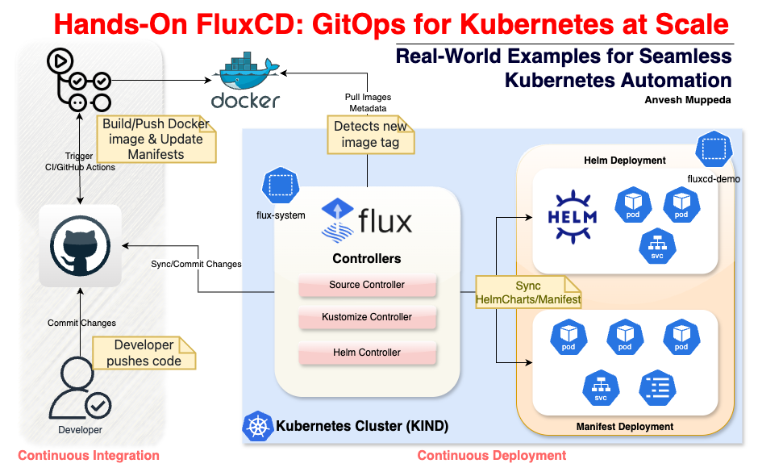
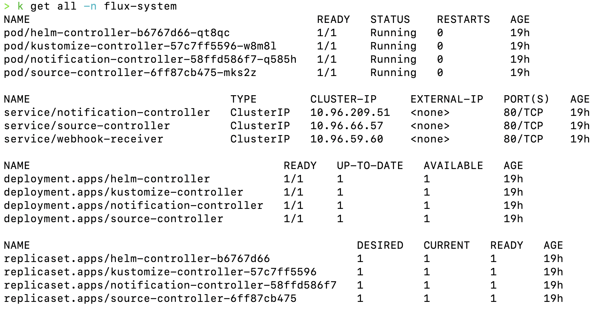

## **Table of Contents**  
1. [Introduction](#introduction)  
2. [Prerequisites](#prerequisites)  
3. [Repository Structure](#repository-structure)  
4. [Bootstrapping Flux](#bootstrapping-flux)  
5. [Example 1: Manual GitOps Deployment](#example-1-manual-gitops-deployment)  
6. [Example 2: Automated Image Updates](#example-2-automated-image-updates)  
7. [Example 3: Helm Chart Deployment](#example-3-helm-chart-deployment)  
8. [Troubleshooting](#troubleshooting)  
9. [Conclusion](#conclusion)  

---

## **Introduction**  
This guide demonstrates how to implement **GitOps workflows** using FluxCD and GitHub Actions. You’ll learn to:  
- Deploy apps manually via Git commits  
- Automatically update deployments when images change  
- Manage Helm charts declaratively  

---

## **Prerequisites**  
- Kubernetes cluster (e.g., kind [Spin Up a Local Kubernetes Cluster with kind in Minutes](./../cluster-setup/kind.md))  
- `kubectl` access to the cluster  
- GitHub repository with [personal access token](https://github.com/settings/tokens) (repo scope)  
- Docker Hub account (for image registry)  

---

## **Repository Structure**  
```bash
📂 kubernetes  
│── fluxcd  
│   ├── repos  
│   │   ├── app1/               # App1 code + Kubernetes manifests  
│   │   ├── app2/               # App2 code  
│   │   ├── app3/               # Helm chart for App3  
│   │   └── infra-repo/         # Flux configurations  
└── .github/workflows/         # CI/CD pipelines  
```

---

## **Bootstrapping Flux**  

### **1. Install Flux CLI**  
```bash
# macOS/Linux
brew install fluxcd/tap/flux

# Verify
flux --version
```

### **2. Bootstrap Flux on Cluster**  
```bash
flux bootstrap github \
  --owner=your-github-username \
  --repository=kubernetes \
  --branch=fluxcd \
  --path=fluxcd/repos/infra-repo/clusters/dev \
  --personal
```

This:  
- Creates `flux-system` namespace  
- Deploys Flux controllers (source, kustomize, helm)  
- Configures Git repository synchronization  



---

## **Example 1: Manual GitOps Deployment**  
*Deploy app1 by committing Kubernetes manifests*  

### **Workflow**  
```mermaid
graph LR
  A[Developer] --> B[Code Changes]
  B --> C[GitHub Actions: Build/Push Image]
  C --> D[Update Deployment YAML]
  D --> E[Flux Syncs Cluster]
```

### **1. Configure Flux Objects**  
**a. GitRepository (fluxcd/repos/infra-repo/apps/app1/gitrepository.yaml)**  
```yaml
apiVersion: source.toolkit.fluxcd.io/v1
kind: GitRepository
metadata:
  name: app1
  namespace: fluxcd-demo
spec:
  url: https://github.com/anveshmuppeda/kubernetes
  ref:
    branch: fluxcd
  interval: 1m
```

**What it does**:  
- Monitors `fluxcd` branch in your repo  
- Checks for changes every minute  

**b. Kustomization (fluxcd/repos/infra-repo/apps/app1/kustomization.yaml)**  
```yaml
apiVersion: kustomize.toolkit.fluxcd.io/v1
kind: Kustomization
metadata:
  name: app1
  namespace: fluxcd-demo
spec:
  path: "./fluxcd/repos/app1/deploy"
  sourceRef:
    kind: GitRepository
    name: app1
  interval: 5m
  prune: true
```

**What it does**:  
- Applies manifests from app1/deploy directory  
- Auto-deletes removed resources (`prune: true`)  
- Syncs every 5 minutes  

### **2. GitHub Actions Automation (.github/workflows/docker-build-push-update.yaml)**  
```yaml
name: App1 CI/CD Pipeline

on:
  push:
    branches: [fluxcd]
    paths: [fluxcd/repos/app1/src/**]

jobs:
  build-push:
    runs-on: ubuntu-latest
    steps:
      - name: Checkout code
        uses: actions/checkout@v3

      - name: Build Docker image
        uses: docker/build-push-action@v4
        with:
          context: fluxcd/repos/app1/src
          tags: anvesh35/fluxcd-demo-app1:${{ github.sha }}
          push: true

      - name: Update deployment manifest
        run: |
          sed -i "s|image:.*|image: anvesh35/fluxcd-demo-app1:${{ github.sha }}|" \
            fluxcd/repos/app1/deploy/app1-deployment.yaml

      - name: Commit changes
        uses: EndBug/add-and-commit@v7
        with:
          message: "Update app1 to ${{ github.sha }}"
          branch: fluxcd
```

**Workflow**:  
1. Developer pushes code to `app1/src`  
2. GitHub Actions:  
   - Builds Docker image with commit SHA tag  
   - Updates app1-deployment.yaml 
   - Commits changes to `fluxcd` branch  
3. Flux detects Git changes and deploys new image  

---

## **Example 2: Automated Image Updates**  
*Auto-update app2 when new images are pushed*  

### **Workflow**  
```mermaid
graph LR
  A[Developer] --> B[Push Code]
  B --> C[GitHub Actions: Build/Push Image]
  C --> D[Flux Detects New Image]
  D --> E[Auto-Update Deployment]
  E --> F[Git Commit]
```  


### We will also need to provide authentication for our git repo  
```bash
flux create secret git app2-githubsecret --url https://github.com/anveshmuppeda/kubernetes --username '' --password '' --namespace fluxcd-demo
```  

### **1. Configure Flux Components**  

**a. GitRepository (fluxcd/repos/infra-repo/apps/app2/gitrepository.yaml)**  
```yaml
apiVersion: source.toolkit.fluxcd.io/v1
kind: GitRepository
metadata:
  name: app2
  namespace: fluxcd-demo
spec:
  interval: 1m0s
  ref:
    branch: fluxcd
  url: https://github.com/anveshmuppeda/kubernetes
  secretRef:
    name: app2-githubsecret
```

**b. Kustomization (fluxcd/repos/infra-repo/apps/app2/kustomization.yaml)**  
```yaml
apiVersion: kustomize.toolkit.fluxcd.io/v1
kind: Kustomization
metadata:
  name: app2
  namespace: fluxcd-demo
spec:
  path: "./fluxcd/repos/infra-repo/apps/app2/deploy"
  sourceRef:
    kind: GitRepository
    name: app2
  interval: 15m
```

**c. Image Automation Objects**  
```bash
kubectl apply -f fluxcd/repos/infra-repo/apps/app2/imagerepository.yaml
kubectl apply -f fluxcd/repos/infra-repo/apps/app2/imagepolicy.yaml
kubectl apply -f fluxcd/repos/infra-repo/apps/app2/imageupdateautomation.yaml
```

### Create Docker registry secret to authenticate docker registry  
We need to create a image registry credential where we will push our image:  
```bash
kubectl -n default create secret docker-registry dockerhub-credential --docker-username '' --docker-password '' --docker-email 'test@test.com'
```

**imagerepository.yaml**  
```yaml
apiVersion: image.toolkit.fluxcd.io/v1beta2
kind: ImageRepository
metadata:
  name: app2
  namespace: fluxcd-demo
spec:
  image: docker.io/anvesh35/fluxcd-demo-app2
  interval: 1m0s
  secretRef:
    name: dockerhub-credential
```

**What it does**:  
- Scans Docker Hub for new tags of [fluxcd-demo-app2](https://hub.docker.com/repository/docker/anvesh35/fluxcd-demo-app2/general)    

**imagepolicy.yaml**  
```yaml
apiVersion: image.toolkit.fluxcd.io/v1beta2
kind: ImagePolicy
metadata:
  name: app2
  namespace: fluxcd-demo
spec:
  imageRepositoryRef:
    name: app2
  policy:
    semver:
      range: ">=1.0.0"
```

**What it does**:  
- Approves image tags matching `v1.0.0` or higher  

**imageupdateautomation.yaml**  
```yaml
apiVersion: image.toolkit.fluxcd.io/v1beta1
kind: ImageUpdateAutomation
metadata:
  name: app2
  namespace: fluxcd-demo
spec:
  interval: 1m0s
  sourceRef:
    kind: GitRepository
    name: app2
  git:
    checkout:
      ref:
        branch: fluxcd
    commit:
      author:
        email: fluxcdbot@users.noreply.github.com
        name: fluxcdbot
      messageTemplate: '{{range .Updated.Images}}{{println .}}{{end}}'
    push:
      branch: fluxcd
  update:
    path: ../fluxcd/repos/infra-repo/apps/app2/deploy/app2-deployment.yaml
    strategy: Setters
```

**What it does**:  
- Updates app2-deployment.yaml(fluxcd/repos/infra-repo/apps/app2/deploy/app2-deployment.yaml) with new image tags  
- Commits changes back to Git  


### **2. GitHub Actions Pipeline (.github/workflows/docker-build-push.yaml)**  
```yaml
name: App2 CI/CD Pipeline

on:
  workflow_dispatch:
    inputs:
      version-bump:
        description: 'SemVer bump type'
        required: true
        default: 'minor'
        type: choice
        options: [major, minor, patch]

jobs:
  build-push:
    runs-on: ubuntu-latest
    steps:
      - name: Checkout code
        uses: actions/checkout@v3

      - name: Calculate new version
        id: version
        run: |
          # ... (semantic version calculation logic)

      - name: Build and push
        uses: docker/build-push-action@v4
        with:
          tags: |
            anvesh35/fluxcd-demo-app2:${{ steps.version.outputs.new-tag }}
            anvesh35/fluxcd-demo-app2:latest
```

**Workflow**:  
1. Developer triggers workflow (manual or via push)  
2. GitHub Actions:  
   - Calculates next semantic version (e.g., `v1.1.0`)  
   - Builds/pushes image to Docker Hub  
3. Flux:  
   - Detects new image tag via ImageRepository  
   - Updates deployment YAML via ImageUpdateAutomation  
   - Commits change to Git  
   - Applies updated manifest to cluster  

---

## **Example 3: Helm Chart Deployment**  
*Deploy app3 using Helm charts*  

### **Workflow**  
```mermaid
graph LR
  A[Developer] --> B[Update Helm Chart]
  B --> C[GitHub Actions: Update Values]
  C --> D[Flux Syncs HelmRelease]
  D --> E[Cluster Deployment]
```

### **1. Configure Flux Components**  

**a. GitRepository (fluxcd/repos/infra-repo/apps/app3/gitrepository.yaml)**  
```yaml
apiVersion: source.toolkit.fluxcd.io/v1
kind: GitRepository
metadata:
  name: app3
  namespace: fluxcd-demo
spec:
  url: https://github.com/anveshmuppeda/kubernetes
  ref:
    branch: fluxcd
  interval: 1m
  ignore: |
    /*
    !/fluxcd/repos/app3/
```

**What it does**:  
- Tracks only the `app3/charts` directory  

**b. HelmChart (fluxcd/repos/infra-repo/apps/app3/helmchart.yaml)**  
```yaml
apiVersion: source.toolkit.fluxcd.io/v1beta1
kind: HelmChart
metadata:
  name: app3-chart
  namespace: fluxcd-demo
spec:
  chart: fluxcd/repos/app3/charts/simple-chart
  sourceRef:
    kind: GitRepository
    name: app3
  interval: 1m
```

**What it does**:  
- Packages Helm chart from Git path  
- Reconciles on every commit  

**c. HelmRelease (fluxcd/repos/infra-repo/apps/app3/helmrelease.yaml)**  
```yaml
apiVersion: helm.toolkit.fluxcd.io/v2
kind: HelmRelease
metadata:
  name: app3-release
  namespace: fluxcd-demo
spec:
  interval: 1m
  chartRef:
    kind: HelmChart
    name: app3-chart
  values:
    image:
      repository: anvesh35/fluxcd-demo-app1
      tag: latest
```

**What it does**:  
- Deploys `simple-chart` with custom image values  
- Auto-upgrades on chart changes  

### **2. GitHub Actions Integration**  
Add to `docker-build-push-update.yaml`:  
```yaml
- name: Update Helm values
  run: |
    sed -i "s|tag:.*|tag: ${{ env.VERSION }}|" \
      fluxcd/repos/app3/charts/simple-chart/values.yaml
    sed -i "s|tag:.*|tag: ${{ env.VERSION }}|" \
      fluxcd/repos/infra-repo/apps/app3/helmrelease.yaml
```

**Workflow**:  
1. Code change triggers image build  
2. GitHub Actions updates Helm chart values  
3. Flux:  
   - Detects changes in HelmRelease  
   - Upgrades Helm release with new image tag  

---

## **Troubleshooting**  

### **Common Commands**  
```bash
# Check Flux components
flux check

# View synchronization status
flux get sources git
flux get kustomizations

# Inspect image automation
flux get image repositories
flux get image policies

# Debug Helm releases
flux get helmreleases
helm list -n fluxcd-demo

# Tail logs
flux logs --level=error
```

### **Common Issues**  
1. **Troubleshooting: "Cannot Create Empty Commit" Error**  
    *Resolving Flux's `clean working tree` Issue*  
    #### **Error Message**  
    ```bash
    ✗ cannot create empty commit: clean working tree
    ```

    #### **What Does This Mean?**  
    Flux attempted to commit its generated manifests to your Git repository but found **no changes** to commit.  
    - **Technical Cause**: The go-git library (used by Flux) detected a clean working tree (no file changes) and rejected an empty commit.  
    - **Flux Equivalent**:  
      ```bash
      git add -A
      git commit -m "Add Flux manifests"  # Fails if no changes
      ```

    #### **Why This Happens**  
    Common scenarios:  

    1. **Repeated Bootstrap**  
      - You've already run `flux bootstrap` on the same branch/path.  
      - Flux generates identical manifests, so Git sees no difference.  

    2. **Pre-Existing Manifests**  
      - Your target `--path` already contains Flux files (`gotk-components.yaml`, etc.).  
      - Flux doesn't overwrite existing files without explicit changes.  

    3. **Empty Branch**  
      - Brand-new branch with no prior commits (Git disallows first commit being empty).  


    #### **Step-by-Step Solutions**  

    ##### **1. Bootstrap to a New Path/Branch**  
    ```bash
    # New path
    flux bootstrap github \
      --path=clusters/new-environment \  # Changed from original path
      --branch=fluxcd \
      # ...other flags

    # New branch
    git checkout --orphan flux-new
    flux bootstrap github \
      --branch=flux-new \  # New branch name
      # ...other flags
    ```

    ##### **2. Clean Existing Manifests**  
    ```bash
    git checkout fluxcd
    rm -rf clusters/my-cluster/*  # Replace with your --path
    git add -A && git commit -m "chore: reset for Flux bootstrap"
    flux bootstrap ...  # Re-run with original flags
    ```

    ##### **3. Seed Initial Commit (For Empty Branches)**  
    ```bash
    git checkout --orphan fluxcd
    git commit --allow-empty -m "chore: initial commit"
    git push origin fluxcd
    flux bootstrap ...  # Now works on non-empty branch
    ```

    ##### **4. Manual Flux Installation (Non-GitOps)**  
    ```bash
    flux install \
      --components=source-controller,kustomize-controller \
      --namespace=flux-system
    ```

    #### **Prevention Tips**  
    - **First-Time Setup**: Always start with an empty directory for `--path`.  
    - **Branch Hygiene**: Use dedicated branches for Flux (e.g., `flux-prod`, `flux-staging`).  
    - **Automation Guard**: In CI/CD pipelines, add checks:  
      ```bash
      git diff-index --quiet HEAD || git commit -m "Update Flux manifests"
      ```

    **Pro Tip**: If you're **re-bootstrapping** to update components, use:  
    ```bash
    flux bootstrap ... --force  # Overwrites existing files
    ```

    Integrate this into your troubleshooting section to help users resolve empty-commit issues quickly! 🛠️
2. **Sync Failures**:  
   - Verify GitHub token permissions  
   - Check `flux-system` pod logs  
3. **Image Not Updated**:  
   - Confirm ImagePolicy matches tag format  
   - Check ImageUpdateAutomation commit history  
4. **Helm Chart Issues**:  
   - Validate chart dependencies (`helm dependency update`)  
   - Check values.yaml compatibility  

---

## **Conclusion**  

### **Workflow Comparison**  
| **Feature**               | Example 1          | Example 2            | Example 3          |  
|---------------------------|--------------------|----------------------|--------------------|  
| **Trigger**               | Git commit         | New image tag        | Git commit         |  
| **Update Mechanism**      | Manual YAML edit   | Automated YAML update| Helm values update |  
| **Flux Components**       | Kustomize          | Image Automation     | Helm Controller    |  
| **Best For**              | Simple apps        | CI/CD pipelines      | Complex deployments|  

### **Next Steps**  
1. Add [Flagger](https://flagger.app/) for canary deployments  
2. Configure [Notifications](https://fluxcd.io/docs/guides/notifications/) (Slack/Teams)  
3. Implement [Multi-Tenancy](https://fluxcd.io/docs/guides/multi-tenancy/)  

## References  
- [🔗 Official FluxCD Documentation](https://fluxcd.io/docs/) 
- [📂 Example Repository](https://github.com/anveshmuppeda/kubernetes/)  
- [Get Started with Flux](https://fluxcd.io/flux/get-started/)  
- [ Manage Helm Releases](https://fluxcd.io/flux/guides/helmreleases/)
- [Flux bootstrap](https://fluxcd.io/flux/installation/bootstrap/)  
- [Ways of structuring your repositories](https://fluxcd.io/flux/guides/repository-structure/)  

---

This guide provides an end-to-end implementation of GitOps with FluxCD. Adapt the examples to your environment and scale as needed!  

