# ⎈ A Hands-On Guide to Kubernetes Monitoring Using Prometheus & Grafana🛠️

#### *⇢ Understanding Prometheus & Grafana Setup in Kubernetes: A Comprehensive Guide*

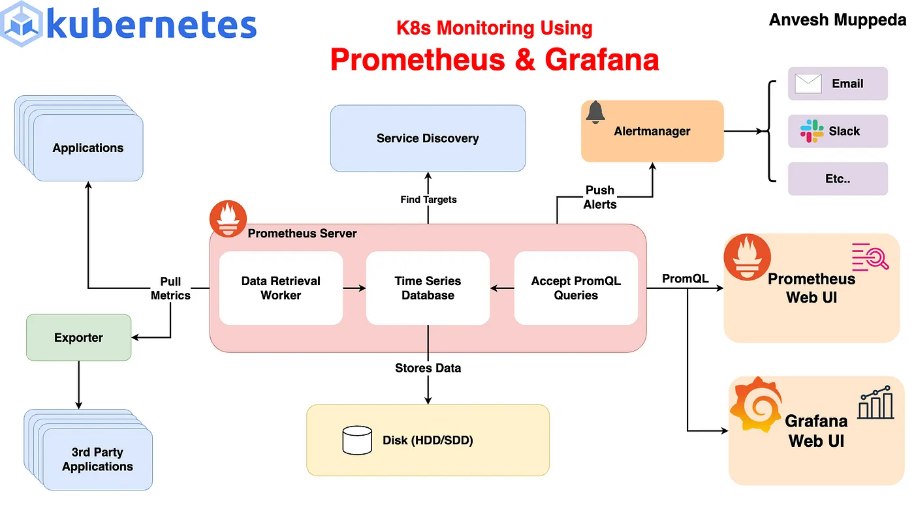


## Introduction
In the dynamic world of containerized applications and microservices, monitoring is indispensable for maintaining the health, performance, and reliability of your infrastructure. Kubernetes, with its ability to orchestrate containers at scale, introduces new challenges and complexities in monitoring. This is where tools like Prometheus and Grafana come into play.     
**Prometheus** is an open-source systems monitoring and alerting toolkit originally built at SoundCloud. It excels at monitoring metrics and providing powerful query capabilities against time-series data. Meanwhile, **Grafana** complements Prometheus by offering visualization capabilities through customizable dashboards and graphs.     
- In this blog post, we will guide you through the process of setting up Prometheus and Grafana on a Kubernetes cluster using Helm. By the end of this tutorial, you will have a robust monitoring solution that allows you to:   
- Collect and store metrics from your Kubernetes cluster and applications.
Visualize these metrics through intuitive dashboards.  
- Set up alerts based on predefined thresholds or anomalies.    
- Gain insights into the performance and resource utilization of your cluster. 


Whether you are deploying your first Kubernetes cluster or looking to enhance your existing monitoring setup, understanding how to leverage Prometheus and Grafana effectively is essential. Let’s dive into the step-by-step process of deploying and configuring these powerful tools on Kubernetes.

### Prerequisites
Before we get started, ensure you have the following: 

- A running Kubernetes cluster.  

- kubectl command-line tool configured to communicate with your cluster.
- Helm (the package manager for Kubernetes) installed.

### Setting up Prometheus and Grafana
**Step 1: Adding the Helm Repository**

First, add the Prometheus community Helm repository and update it:

```yaml
helm repo add prometheus-community https://prometheus-community.github.io/helm-charts
helm repo update
```


**Step 2: Installing Prometheus and Grafana**

Create a custom-values.yaml file to customize the Helm chart installation. This file will configure Prometheus and Grafana to be exposed via NodePorts.   
```yaml
# custom-values.yaml
prometheus:
  service:
    type: NodePort
grafana:
  service:
    type: NodePort
```


Then, install the kube-prometheus-stack using Helm:
```yaml
helm upgrade --install kube-prometheus-stack prometheus-community/kube-prometheus-stack -f custom-values.yaml
```
Output:
```yaml
$ helm upgrade --install kube-prometheus-stack prometheus-community/kube-prometheus-stack -f custom-values.yaml
Release "kube-prometheus-stack" does not exist. Installing it now.
NAME: kube-prometheus-stack
LAST DEPLOYED: Sun Jun 16 17:04:53 2024
NAMESPACE: default
STATUS: deployed
REVISION: 1
NOTES:
kube-prometheus-stack has been installed. Check its status by running:
  kubectl --namespace default get pods -l "release=kube-prometheus-stack"

Visit https://github.com/prometheus-operator/kube-prometheus for instructions on how to create & configure Alertmanager and Prometheus instances using the Operator.
```
**Step 3: Verifying the Installation**

After the installation, you can verify that the Prometheus and Grafana services are created and exposed on NodePorts:
```yaml
kubectl get services
```
You should see output similar to this, showing the services with their respective NodePorts:  
```yaml
$ kubectl get services                                   
NAME                                             TYPE        CLUSTER-IP       EXTERNAL-IP   PORT(S)                         AGE
alertmanager-operated                            ClusterIP   None             <none>        9093/TCP,9094/TCP,9094/UDP      5m19s
kube-prometheus-stack-alertmanager               ClusterIP   10.245.239.151   <none>        9093/TCP,8080/TCP               5m22s
kube-prometheus-stack-grafana                    NodePort    10.245.30.17     <none>        80:31519/TCP                    5m22s
kube-prometheus-stack-kube-state-metrics         ClusterIP   10.245.26.205    <none>        8080/TCP                        5m22s
kube-prometheus-stack-operator                   ClusterIP   10.245.19.171    <none>        443/TCP                         5m22s
kube-prometheus-stack-prometheus                 NodePort    10.245.151.164   <none>        9090:30090/TCP,8080:32295/TCP   5m22s
kube-prometheus-stack-prometheus-node-exporter   ClusterIP   10.245.22.30     <none>        9100/TCP                        5m22s
kubernetes                                       ClusterIP   10.245.0.1       <none>        443/TCP                         57d
prometheus-operated                              ClusterIP   None             <none>        9090/TCP                        5m19s
```
**Step 4: Accessing Prometheus and Grafana**

To access Prometheus and Grafana dashboards outside the cluster, you need the external IP of any node in the cluster and the NodePorts on which the services are exposed.  


Get the external IP addresses of your nodes:
```yaml
kubectl get nodes -o wide
```

You should see output similar to this:

```yaml
$ kubectl get nodes -o wide
NAME                   STATUS   ROLES    AGE   VERSION   INTERNAL-IP   EXTERNAL-IP      OS-IMAGE                         KERNEL-VERSION   CONTAINER-RUNTIME
pool-t5ss0fagn-jeb47   Ready    <none>   57d   v1.29.1   10.124.0.2    146.190.55.222   Debian GNU/Linux 12 (bookworm)   6.1.0-17-amd64   containerd://1.6.28
```

Use the external IP of any node and the NodePorts to access the dashboards: 


Prometheus: http://146.190.55.222:30090   
Grafana: http://146.190.55.222:31519  

### Access Prometheus
Use the below link as above to access the Prometheus UI  

Publiclp:Promethues-Port


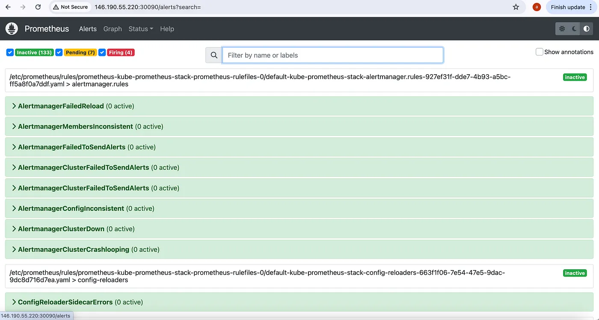

### Access Grafana Default Dashboards  
Use the below link as above to access the Grafana UI

Publiclp:GRAFANA-PORT


Use the below command to get the Grafana Admin login:  


**Username:**

```yaml
$ kubectl get secret --namespace default kube-prometheus-stack-grafana -o jsonpath="{.data.admin-user}" | base64 --decode ; echo
admin
```
**Password:**
```yaml
$ kubectl get secret --namespace default kube-prometheus-stack-grafana -o jsonpath="{.data.admin-password}" | base64 --decode ; echo
prom-operator
```


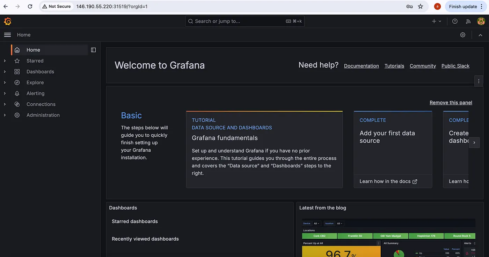

### Default Dashboards

By default our previous setup will add few dashboards:  

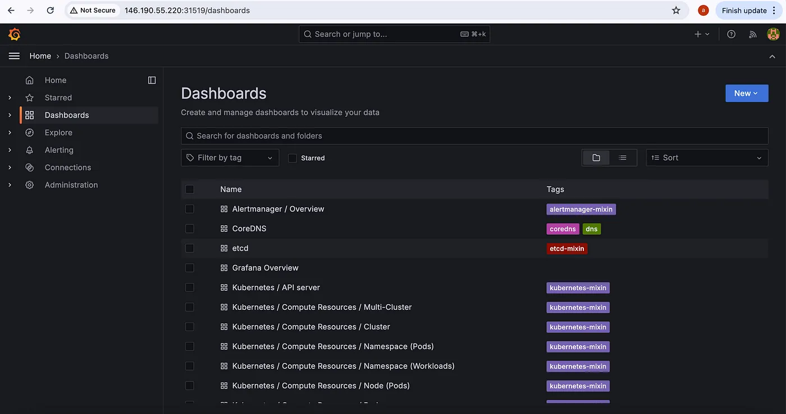

Using these dashboards we can easily monitor our kubernetes cluster  


### Add/Create new Dashboards

We also have the flexibility to create our own dashboards from scratch or import multiple Grafana dashboards from the Grafana library.   


To import a Grafana dashboard, follow these steps: 


**Step 1:** Access the Grafana library.

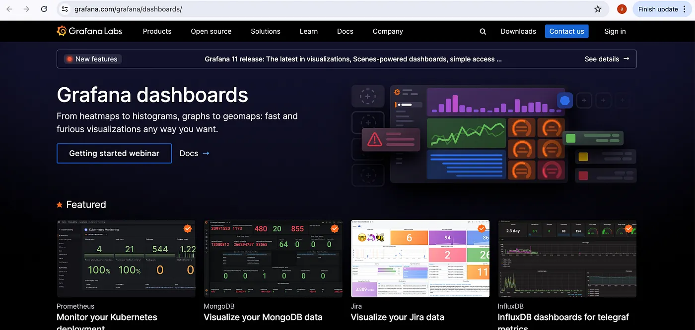

**Step 2.** Select the desired dashboard ID to add.

Considering K8s/Storage/Volumes/Namespace Dashboard

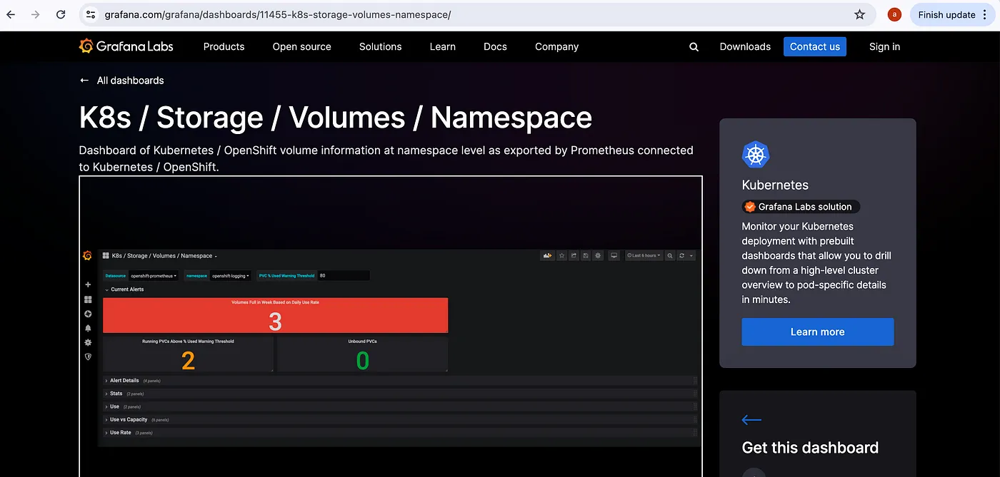


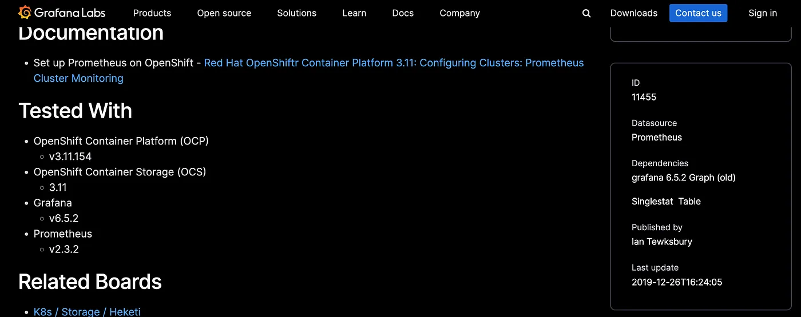

Copy the Id of K8s/Storage/Volumes/Namespace Dashboard i.e., 11455  
   
**Step 3: Import selected Dashboard in Grafana**   

Access Dashboard section & click on Import section.    

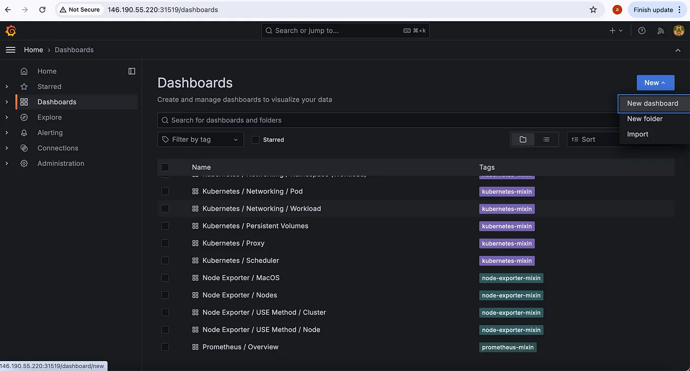

Now enter the ID of the target new Dashboard i.e., 11455.  

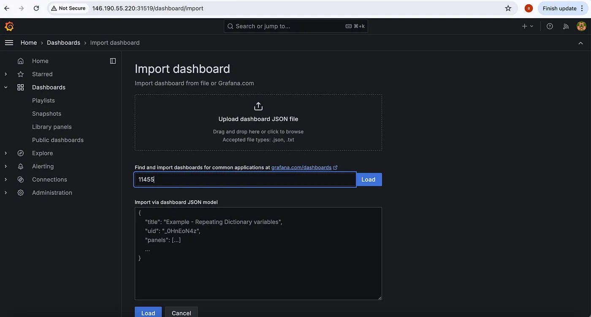

Click on Load to load the new dashboard into Grafana.

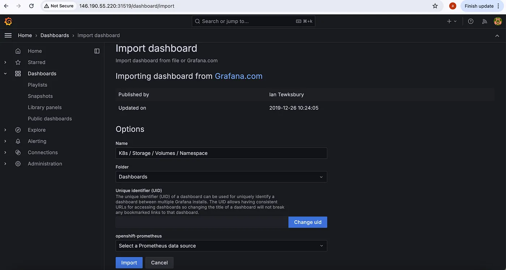

Click on Import to import the new Dashboard & Access it.  

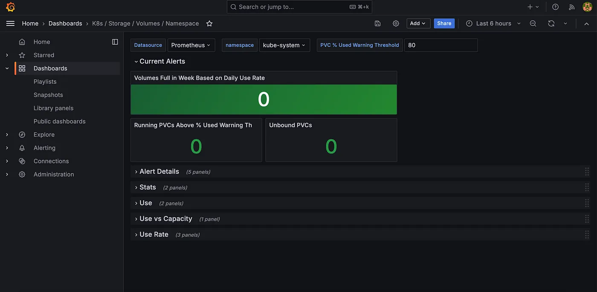


These steps allow us to easily integrate any dashboard from the Grafana library.  


### Prometheus Architecture

Prometheus is a powerful monitoring and alerting toolkit designed for reliability and scalability. Understanding its architecture helps in leveraging its full potential. The Prometheus architecture comprises several key components:  


### Prometheus Server

The Prometheus server is the core component responsible for:  

1. **Data Scraping:** Prometheus periodically scrapes metrics from configured targets, which are typically HTTP endpoints exposing metrics in a specified format.   
2. **Data Storage**: It stores all scraped samples locally using a time series database. Prometheus is designed to be efficient with both storage and retrieval of time series data.    
3. **Querying:** Prometheus allows you to query the time series data via the Prometheus Query Language (PromQL), which enables complex aggregations and calculations.  

### Prometheus Components  

1. **Prometheus Server:** The main component that does the bulk of the work, including scraping metrics from targets, storing the data, and providing a powerful query interface.   
2. **Pushgateway:** An intermediary service used for pushing metrics from short-lived jobs that cannot be scraped directly by Prometheus. This is particularly useful for batch jobs and other processes with a finite lifespan.   
3. **Exporters:** Exporters are used to expose metrics from third-party systems as Prometheus metrics. For example, Node Exporter collects hardware and OS metrics from a node, while other exporters exist for databases, web servers, and more.    
4. **Alertmanager:** This component handles alerts generated by the Prometheus server. It can deduplicate, group, and route alerts to various receivers such as email, Slack, PagerDuty, or other notification systems.   
5. **Service Discovery:** Prometheus supports various service discovery mechanisms to automatically find targets to scrape. This includes static configuration, DNS-based service discovery, and integrations with cloud providers and orchestration systems like Kubernetes.  
6. **PromQL:** The powerful query language used by Prometheus to retrieve and manipulate time series data. PromQL supports a wide range of operations such as arithmetic, aggregation, and filtering.  

### Data Flow in Prometheus

1. **Scraping Metrics:** Prometheus scrapes metrics from HTTP endpoints (targets) at regular intervals. These targets can be predefined or discovered dynamically through service discovery.  
2. **Storing Metrics:** Scraped metrics are stored as time series data, identified by a metric name and a set of key-value pairs (labels).  
3. **Querying Metrics:** Users can query the stored metrics using PromQL. Queries can be executed via the Prometheus web UI, HTTP API, or integrated with Grafana for visualization.  
4. **Alerting:** Based on predefined rules, Prometheus can evaluate metrics data and trigger alerts. These alerts are sent to Alertmanager, which then processes and routes them to the appropriate notification channels.  

### Example of Prometheus Workflow  

1. **Service Discovery:** Prometheus discovers targets to scrape metrics from using service discovery mechanisms. For example, in a Kubernetes environment, it discovers pods, services, and nodes.  
2. **Scraping:** Prometheus scrapes metrics from discovered targets at defined intervals. Each target is an endpoint exposing metrics in a format Prometheus understands (typically plain text).   
3. **Storing:** Scraped metrics are stored in Prometheus’s time series database, indexed by the metric name and labels.  
4. **Querying:** Users can query the data using PromQL for analysis, visualization, or alerting purposes.   
5. **Alerting:** When certain conditions are met (defined by alerting rules), Prometheus generates alerts and sends them to Alertmanager.   
6. **Alertmanager:** Alertmanager processes the alerts, deduplicates them, groups them if necessary, and sends notifications to configured receivers.  

### Understanding the Kubernetes Objects  

The Helm chart deploys various Kubernetes objects to set up Prometheus and Grafana.  
```yaml
$ kubectl get all                                         
NAME                                                            READY   STATUS    RESTARTS   AGE
pod/alertmanager-kube-prometheus-stack-alertmanager-0           2/2     Running   0          38m
pod/kube-prometheus-stack-grafana-76858ff8dd-76bn4              3/3     Running   0          38m
pod/kube-prometheus-stack-kube-state-metrics-84958579f9-g44sk   1/1     Running   0          38m
pod/kube-prometheus-stack-operator-554b777575-hgm8b             1/1     Running   0          38m
pod/kube-prometheus-stack-prometheus-node-exporter-cl98x        1/1     Running   0          38m
pod/prometheus-kube-prometheus-stack-prometheus-0               2/2     Running   0          38m

NAME                                                     TYPE        CLUSTER-IP       EXTERNAL-IP   PORT(S)                         AGE
service/alertmanager-operated                            ClusterIP   None             <none>        9093/TCP,9094/TCP,9094/UDP      38m
service/kube-prometheus-stack-alertmanager               ClusterIP   10.245.239.151   <none>        9093/TCP,8080/TCP               38m
service/kube-prometheus-stack-grafana                    NodePort    10.245.30.17     <none>        80:31519/TCP                    38m
service/kube-prometheus-stack-kube-state-metrics         ClusterIP   10.245.26.205    <none>        8080/TCP                        38m
service/kube-prometheus-stack-operator                   ClusterIP   10.245.19.171    <none>        443/TCP                         38m
service/kube-prometheus-stack-prometheus                 NodePort    10.245.151.164   <none>        9090:30090/TCP,8080:32295/TCP   38m
service/kube-prometheus-stack-prometheus-node-exporter   ClusterIP   10.245.22.30     <none>        9100/TCP                        38m
service/kubernetes                                       ClusterIP   10.245.0.1       <none>        443/TCP                         57d
service/prometheus-operated                              ClusterIP   None             <none>        9090/TCP                        38m

NAME                                                            DESIRED   CURRENT   READY   UP-TO-DATE   AVAILABLE   NODE SELECTOR            AGE
daemonset.apps/kube-prometheus-stack-prometheus-node-exporter   1         1         1       1            1           kubernetes.io/os=linux   38m

NAME                                                       READY   UP-TO-DATE   AVAILABLE   AGE
deployment.apps/kube-prometheus-stack-grafana              1/1     1            1           38m
deployment.apps/kube-prometheus-stack-kube-state-metrics   1/1     1            1           38m
deployment.apps/kube-prometheus-stack-operator             1/1     1            1           38m

NAME                                                                  DESIRED   CURRENT   READY   AGE
replicaset.apps/kube-prometheus-stack-grafana-76858ff8dd              1         1         1       38m
replicaset.apps/kube-prometheus-stack-kube-state-metrics-84958579f9   1         1         1       38m
replicaset.apps/kube-prometheus-stack-operator-554b777575             1         1         1       38m

NAME                                                               READY   AGE
statefulset.apps/alertmanager-kube-prometheus-stack-alertmanager   1/1     38m
statefulset.apps/prometheus-kube-prometheus-stack-prometheus       1/1     38m
```

Here’s a brief explanation of each type of object used:  

### Deployments:  

Deployments ensure that a specified number of pod replicas are running at any given time. They manage the creation, update, and deletion of pods. In this setup, Deployments are used for:  

**Grafana:** Manages the Grafana instance, ensuring it is always available.   
**Kube-State-Metrics:** Exposes Kubernetes cluster-level metrics. 

Example:  

```yaml
deployment.apps/kube-prometheus-stack-grafana              1/1     1            1           38m
deployment.apps/kube-prometheus-stack-kube-state-metrics   1/1     1            1           38m
```
### StatefulSets:  

StatefulSets are used for managing stateful applications that require persistent storage and stable network identities. They ensure that the pods are deployed in a specific order and have unique, stable identifiers. In this setup, StatefulSets are used for:  
 

**Prometheus:** Ensures Prometheus instances have persistent storage for metric data.
**Alertmanager:** Manages the Alertmanager instances.

Example:

```yaml
statefulset.apps/alertmanager-kube-prometheus-stack-alertmanager   1/1     38m
statefulset.apps/prometheus-kube-prometheus-stack-prometheus       1/1     38m
```
### DaemonSets:

DaemonSets ensure that a copy of a pod is running on all (or some) nodes in the cluster. They are commonly used for logging and monitoring agents. In this setup, DaemonSets are used for:  

**Node Exporter:** Collects hardware and OS metrics from the nodes.  

Example:

```yaml
daemonset.apps/kube-prometheus-stack-prometheus-node-exporter   1/1     38m
```
### Cleanup Section
Use the below command to uninstall the prometheus stack  

```yaml
$ helm uninstall kube-prometheus-stack
```

### Advantages of Using Prometheus and Grafana  

Using Prometheus and Grafana together provides a powerful and flexible monitoring solution for Kubernetes clusters. Here are some of the key advantages:  

### Prometheus

1. **Open Source and Community-Driven:** Prometheus is a widely adopted open-source monitoring solution with a large community, ensuring continuous improvements, support, and a plethora of plugins and integrations.   
2. **Dimensional Data Model:** Prometheus uses a multi-dimensional data model with time series data identified by metric name and key/value pairs. This makes it highly flexible and powerful for querying.   
3. **Powerful Query Language (PromQL):** Prometheus Query Language (PromQL) allows for complex queries and aggregations, making it easy to extract meaningful insights from the collected metrics.      
4. **Efficient Storage:** Prometheus has an efficient storage engine designed for high performance and scalability. It uses a local time series database, making it fast and reliable.   


5. **Alerting:** Prometheus has a built-in alerting system that allows you to define alerting rules based on metrics. Alerts can be sent to various receivers like email, Slack, or custom webhooks using the Alertmanager component.   
6. **Service Discovery:** Prometheus supports multiple service discovery mechanisms, including Kubernetes, which makes it easy to dynamically discover and monitor new services as they are deployed.  
### Grafana

1. **Rich Visualization:** Grafana provides a wide range of visualization options, including graphs, charts, histograms, and heatmaps, allowing you to create comprehensive dashboards.   
2. **Customizable Dashboards:** Grafana dashboards are highly customizable, enabling you to create tailored views that meet the specific needs of your team or organization.    
3. **Integration with Multiple Data Sources:** While Grafana works seamlessly with Prometheus, it also supports many other data sources such as Elasticsearch, InfluxDB, and Graphite, making it a versatile tool for centralized monitoring.   
4. **Alerting:** Grafana offers its own alerting system, allowing you to set up alert rules on dashboard panels and receive notifications via multiple channels, such as email, Slack, and PagerDuty.  
5. **Templating:** Grafana allows the use of template variables in dashboards, making them reusable and more interactive. This feature helps in creating dynamic and flexible dashboards.  
6. **User Management and Sharing:** Grafana supports user authentication and role-based access control, making it easier to manage access to dashboards. Dashboards can also be easily shared with team members or embedded in other applications.  
7. **Plugins and Extensions:** Grafana has a rich ecosystem of plugins for different data sources, panels, and apps, allowing you to extend its functionality to meet your specific monitoring needs.  
### Combined Benefits

1. **Comprehensive Monitoring Solution:** Together, Prometheus and Grafana provide a complete monitoring solution, from metrics collection and storage (Prometheus) to powerful visualization and analysis (Grafana).  
2. **Scalability:** Both Prometheus and Grafana are designed to scale with your infrastructure. Prometheus can handle millions of time series, while Grafana can manage numerous dashboards and data sources.   
3. **Real-Time Monitoring and Alerting:** With Prometheus’s real-time metrics collection and Grafana’s real-time visualization, you can monitor your infrastructure’s health continuously and get alerted to issues promptly.  
4. **Ease of Use:** Setting up Prometheus and Grafana is straightforward, especially with tools like Helm for Kubernetes, making it easy to deploy and manage the monitoring stack.    
5. **Extensibility:** Both tools are highly extensible, allowing you to integrate them with other systems and customize them to fit your specific requirements.  


By leveraging the strengths of Prometheus and Grafana, you can ensure that your Kubernetes environment is well-monitored, making it easier to maintain performance, reliability, and efficiency.
## Conclusion
Setting up Prometheus and Grafana on Kubernetes using Helm is straightforward and provides a powerful monitoring solution for your cluster. By exposing the services via NodePorts, you can easily access the dashboards from outside the cluster. This setup allows you to monitor your cluster’s performance, visualize metrics, and set up alerts to ensure your applications run smoothly.  


